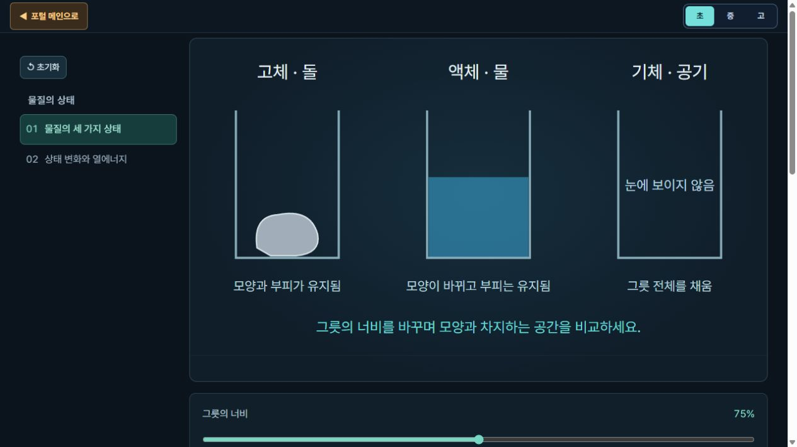
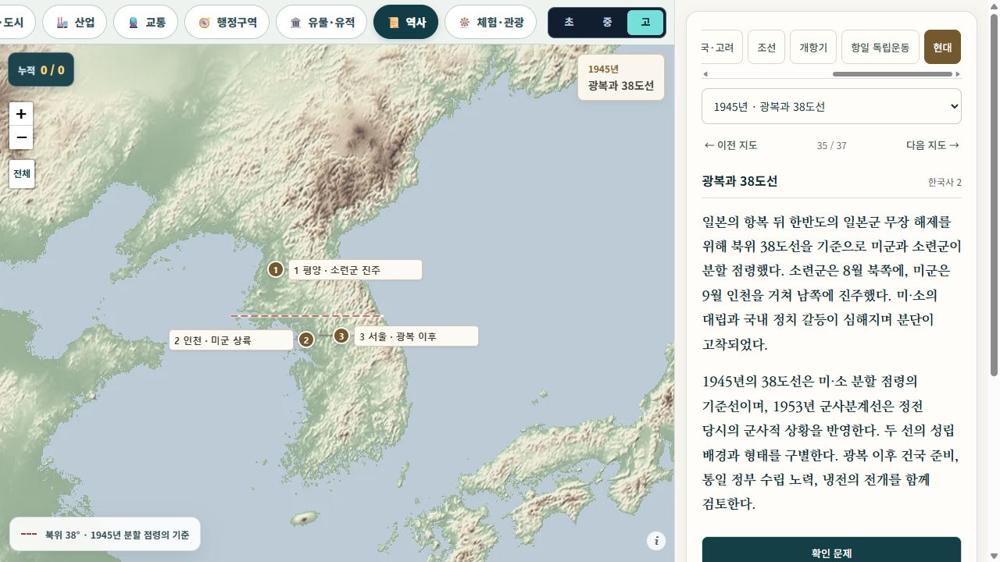
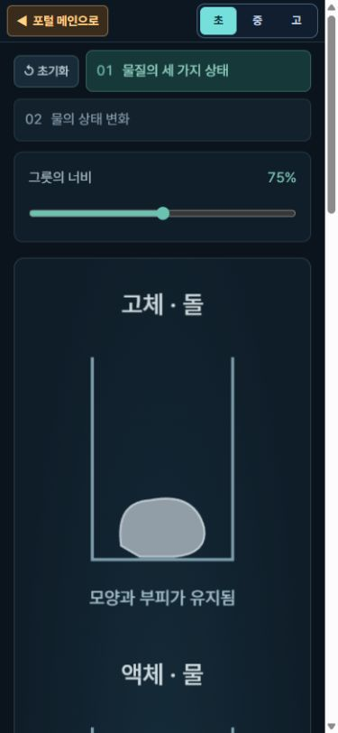

# 과학 모형·역사 지도 후속 수정 — 2026-10-11

로컬 서버 `127.0.0.1:8876`에서 수정 후 확인했다. 운영 서버 반영 여부는 확인하지 않았다. 아래의 화면 연결 검사를 모든 역사·과학 사실의 검증 완료로 해석하면 안 된다.

## 반영한 변경

### 2022 교육과정에 따른 화면 범위

| 대상 | 변경 |
| --- | --- |
| 초 인체 | 소화·순환·호흡·배설·뼈와 근육만 제공. 각 모형은 전신 기관, 호흡 운동, 팔의 움직임 등 해당 장면으로 제한 |
| 중 신경 | 뇌·반사·눈·귀 제공. 자율신경 상세 경로·동공 반사·시냅스 상세 장면 제외. 해당 범위 객관식 5문항 구성 |
| 면역 | 고 모드에서 제공 |
| 뼈와 근육 | 초 모드에서 제공. 근절 활주 장면은 메뉴에서 제외. 앞쪽·뒤쪽 근육, 위팔뼈·아래팔뼈로 명칭 정리 |
| 초 우주 | 태양계, 계절별 별자리, 북쪽 하늘, 별의 위치 변화, 지구와 달, 계절별 태양 고도 제공. 일식·월식 및 별의 밝기·표면 온도는 중부터 제공 |
| 천구·별의 진화 | 고에서 제공. 천구 좌표 관련 과목 표기는 고급 지구과학으로 수정 |
| 초 물질 | 입자 그림 대신 돌·물·공기의 모양과 공간 비교. 물의 상태 변화는 얼음·물·수증기로 표시. 모바일에서 세로 배치 |
| 중 물질 | 기체 모형의 mol·K·PV=nRT 표시 제외. 섭씨 온도·부피·상대 압력 제공. 원자 모형의 질량수·동위 원소 선택 제외, 양성자·중성자·전자 구성은 유지. 반응식은 분자 수의 비로 표시 |
| 고 오비탈·전자 배치 | 과목을 고급 화학으로 정정 |

초 호흡의 기체 성분 비율 표를 기관의 역할 설명으로 바꾸고, 단일 장면 위의 빈 공간을 없앴다. 학교급 버튼은 초·중·고를 사용한다. 출판사·저자명은 학생용 제목에 추가하지 않았다.

근거 원문:

- `references/moe/2022-revised-curriculum/extracted/09-science.txt`: [4과13], [6과04], [6과12~13], [9과07], [9과11-02], [9과13], [9과15], [9과20], [12생과02], [12지구03].
- `references/moe/2022-revised-curriculum/extracted/20-science-specialized.txt`: [12고지03-01], [12고화01-01~02].
- [6과04]의 뼈·근육 범위 및 중·고 제외 해설, [4과13]의 구체적 물리량·위상 변화 원인 제한, [9과11-02]의 질량수·동위 원소 제외 해설을 적용했다.
- 기존 과학 교과서 대조 범위는 `docs/model-lesson-review-2026-10-11.json`에 있다. 보관된 설명 프로필 수와 실제 제공 화면 수는 다르다.

## 역사 지도

기존 32개에 다음 5개를 추가하여 37개가 되었다. 초는 33개, 중·고는 각각 37개를 제공한다.

| 새 지도 | 대조 자료 | 표현 |
| --- | --- | --- |
| 구석기·신석기 유적과 생활 | 확보한 2022 동아 사회과 부도 PDF 56쪽 | 전곡리·석장리·암사동·동삼동의 대표 위치 |
| 한양의 궁궐·종묘·사직 | 같은 부도 64쪽 | 경복궁·종묘·사직단의 실제 상대 위치. 확대 시 흐려지는 지형 타일 대신 방향·축척이 있는 위치 지도 |
| 병자호란과 남한산성 | 같은 부도 65쪽, 우리역사넷 병자호란 | 한양·강화도·남한산성·삼전도 |
| 광복과 38도선 | 같은 부도 70쪽, 우리역사넷 광복 자료 | 1945년 북위 38도선. 1953년 군사분계선과 구분 |
| 민주화 운동의 지역과 흐름 | 같은 부도 76~77쪽, 민주화운동기념사업회 자료 | 서울·마산·광주·부산의 대표 사건. 서로 다른 시기의 운동을 단일 이동 경로로 연결하지 않음 |

자료 추출문은 `tmp/korea-map-review/sources/1.json`, 지도별 공식 출처 URL은 `data/history-atlas.js`와 화면의 자료 정보에 있다. 선사 유적의 시작·끝 연도는 정렬용 범위이며 각 유적의 연대가 아니다. 대표 지점은 영토나 당시 도로의 복원이 아니다.

### 객관식

- 각 지도에서 학교급별 확인 문제를 연다. 초 33 + 중 37 + 고 37 = **107문항**.
- 지도별로 초는 주요 위치·인물·사건, 중은 관계와 전개, 고는 정책·국제 관계·시기별 비교를 중심으로 구성했다.
- 출판사 평가 문항을 그대로 가져온 은행이 아니라, 확인한 지도·설명에 맞추어 작성한 문항이다.
- 초안의 무관한 시대·엉뚱한 물리량 등을 보기로 쓴 항목을 수정했다. 최종 데이터의 질문 ID·보기 4개·정답 인덱스·해설을 검사했다.
- 공통 채점기를 사용한다. 오답에는 재선택 안내만 표시한다. 정답을 다시 고르면 해설이 열리며 최초 응답의 정오는 유지된다.
- `learning:answer` 이벤트와 문항 ID·학교급을 제공한다. 이번 작업에 학생 계정·서버 저장·분석 시스템 구현은 포함하지 않는다. 기존 국내지도 누적 기록에 새 역사 문항이 자동 합산되도록 연결한 것은 아니다.
- 문항·보기는 `Class Exam Batang`을 사용한다. 밝은 문제창의 호버·번호·문항 수·피드백 색상을 보정했다.

## 검증한 범위

1. **63개 과학 학교급 화면**: 인체 18, 우주 24, 물질 21을 실제 브라우저로 순회. 선택된 학교급, 모형 요소, 설명/문항 연결, 페이지 가로 넘침을 검사했다. 물질 SVG의 NaN·Infinity도 없었다. 이는 모든 세부 조작과 과학 사실을 개별 검증한 결과는 아니다.
2. 새 지도 5개 × 초·중·고 = **15개 조합**: 설명·문제 버튼·마커 수·가로 넘침을 확인했다. 한양 축척은 해당 지도에서만 한 개 표시되고 다른 지도에서 제거된다.
3. 역사 문제 실제 오답 → 재선택 → 정답 → 결과: 최초 오답인 경우 결과가 **1문제 중 0문제**로 유지되는 것을 확인했다. 오답에서 정답 표시·해설은 보이지 않았다.
4. 390×844 모바일에서 문제창 가로 넘침 없음, 수능형 바탕 글꼴과 보기 대비 확인. 초 물질 그림도 가로 스크롤 없이 세로 배치된다.
5. Node 테스트 **19/19 통과**: 학교급 범위·직접 URL 제한, 37개 지도 설명과 107문항, 추가 좌표 범위, 소장 강조·기존 모형 설명·문항 ID 등.
6. 일식·월식 접선/겹침, 별 진화 경로·연속성, 우주 10개 경로·152문항 배정 검사 통과. 이 152개는 기존 우주 원본 은행의 항목 수이며 학교급 조합 수와 다르다.

실행 명령:

```text
node --test tests/model-scope-history.test.cjs tests/body-model-science.test.cjs tests/model-lessons.test.cjs tests/school-level-content.test.cjs tests/objective-school-practice.test.cjs tests/space-school-practice.test.cjs
node tests/eclipse-geometry.cjs
node tests/stellar-evolution.cjs
node tests/space-topic-contract.cjs
```

검사 데이터: `model-63-route-review.json`, `model-map-browser-review.json`, `matter-scope-review.json`.

## 전체 완료로 보고하지 않은 항목

- 63개 화면 내부의 모든 장면·조작·설명·문항을 교과서의 모든 해당 그림·본문과 하나씩 대조한 검수.
- 기존 역사 영토 오버레이 경계의 정확성, 전체 지리 수치의 기준 연도, 모든 문화유산 사진·출처의 재검수.
- 한국사 2 교과서 전체 본문과 현대사 문항을 개별 대조한 기록. 새 현대사 지도는 확보한 초등 부도와 공식 역사 자료를 근거로 했다.
- 운영 서버에서 같은 변경이 보이는지 확인하는 배포 검증.

## 화면 증거







